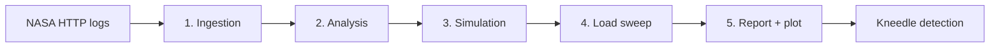

# Web Server Simulation

> An empirical, discrete-event simulation of HTTP request queueing
> using 1.5 million real NASA server logs from 1995.

> [Bosanski](README.md) | **English**

---

## Description

This project analyzes web server behavior under load using
**trace-driven simulation** -- instead of a theoretical M/M/1 model,
the simulation replays real traffic patterns from NASA HTTP logs.

The dataset contains 1,568,252 HTTP requests collected at NASA's
Kennedy Space Center server during August 1995. Logs are
automatically downloaded from Kaggle via the `kagglehub` library.

### Why empirical simulation?

Theoretical models like M/M/1 require request arrivals to follow a
**Poisson process** and request sizes to follow a known
**distribution**. Testing against real data:

1. **Arrivals are not Poisson** -- KS test rejects (p < 0.05).
   Empirical resampling is used instead.
2. **Request sizes fit neither lognormal nor Pareto** -- both
   distributions fail the KS test. The full trace is preserved.
3. **Resampling** -- the simulation randomly picks from real
   measured values, preserving the burstiness and variability of
   real traffic.

---

## Goal

Identify the **overload knee** of a web server -- the utilization
level (ρ) beyond which queue wait times explode. The
**Kneedle algorithm** detects the knee on the response curve.

---

## Results

> **Note:** These figures are generated automatically by running
> `python main.py all_sweep` (or `docker compose run sim all_sweep`).

### Response time vs load
*P50, P95, P99 queue wait times across 15 utilization levels
(30 replications each). Dashed vertical line marks saturation
(ρ = 1.0).*

### Service time fit
*Response byte-size distribution with lognormal and Pareto
fitted curves.*


### Early overload signs

| ρ | ρ actual | p95 | × baseline | p99 | × baseline |
|---|---|---|---|---|---|
| 0.70 | 0.721 | 3.43s | 4.6× | 5.59s | 3.0× |
| 0.78 | 0.797 | 4.96s | 6.6× | 8.01s | 4.4× |
| **0.85** | **0.874** | **8.93s** | **11.9×** | **14.71s** | **8.0×** |
| 0.93 | 0.952 | 41.11s | 54.8× | 62.79s | 34.2× |
| 1.00 | 0.981 | 499.29s | 666.1× | 584.99s | 318.9× |

---

## Conclusion

- **Critical threshold**: ρ ≈ 0.85 (λ ≈ 22.5 req/s) -- beyond this
  point tail latency becomes unacceptable (p95 > 8s).
- **Saturation**: ρ ≈ 1.0 (λ ≈ 26.5 req/s) -- server is fully
  saturated, wait times reach hundreds of seconds.
- **Kneedle knee**: ρ = 0.997 -- algorithm confirms saturation as
  the point of maximum curvature.
- **Non-linear degradation**: latency does not grow linearly --
  beyond ρ = 0.85, every additional load increase causes exponential
  wait time growth.

---

## Architecture



Detailed phase walkthrough: [architecture documentation]
(docs/ARCHITECTURE.md).

---

## Quick start

### Without Docker (UV)

```bash
uv sync
python main.py all_sweep
```

### With Docker

```bash
docker compose build
docker compose run sim all_sweep
```

### Subcommands

| Command | Description |
|---|---|
| `python main.py ingest` | Parse raw NASA logs to parquet |
| `python main.py analyze` | Analyze traffic (Poisson test, distributions) |
| `python main.py simulate` | Run a single simulation |
| `python main.py sweep` | Run load sweep (15 levels × 30 reps) |
| `python main.py all` | Ingest + analyze + simulate |
| `python main.py all_sweep` | Ingest + analyze + sweep |

---

## Reproducibility

- **Source data**: NASA HTTP logs (Kaggle dataset,
  `adchatakora/nasa-http-access-logs`), auto-downloaded
- **Seed**: 42 (configurable)
- **Replications**: 30 per load level
- **Warmup period**: 500s (excludes startup transients)
- **All dependencies**: listed in `pyproject.toml`

---

## Project structure

```
├── main.py                 # Entry point (CLI dispatcher)
├── pyproject.toml          # Dependencies and tool config
├── Dockerfile              # Multi-stage Docker build
├── docker-compose.yml      # Docker Compose configuration
├── README.md               # Bosanski
├── README.en.md            # This file
├── src/
│   ├── cli/                # CLI layer (argparse, commands)
│   ├── ingestion/          # Log parsing to parquet
│   ├── analysis/           # Traffic characterization
│   ├── simulation/         # SimPy engine
│   └── experiment/         # Load sweep orchestrator
├── docs/
│   ├── ARHITEKTURA.md      # Architecture (Bosanski)
│   ├── ARCHITECTURE.md     # Architecture (English)
│   ├── IZVJESTAJ.md        # Report (Bosanski)
│   └── REPORT.md           # Report (English)
└── data/                   # Generated data (parquet, SVG, JSON, npy)
```

---

## References

- [Architecture documentation (BS)](docs/ARHITEKTURA.md)
- [Architecture documentation (EN)](docs/ARCHITECTURE.md)
- [Overload analysis report (BS)](docs/IZVJESTAJ.md)
- [Overload analysis report (EN)](docs/REPORT.md)
